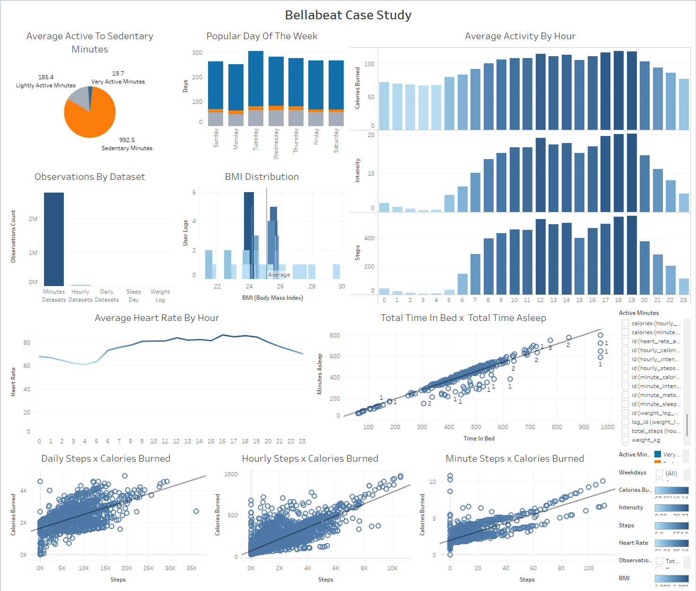

# Bellabeat Case Study: 
## How Can A Wellness Technology Company Play it Smart?

##### Author: Kevin Leung
##### Date: 2025-01-27
##### [Full Document](https://github.com/kleung157/Bellabeat_Case_Study_Google_Data_Analytics/blob/ba4e810b2ea8f7d907c0e844fd44f2d4f9583cc6/bellabeat_case_study_deliverables.Rmd)

##### Data Analysis Contents:
##### 1. Ask
##### 2. [Prepare](https://github.com/kleung157/Bellabeat_Case_Study_Google_Data_Analytics/blob/a4badf3cdaa88cf38fea809e00263c21accd68fa/bellabeat_data_preparation_2025_01_27.Rmd)
##### 3. [Process](https://github.com/kleung157/Bellabeat_Case_Study_Google_Data_Analytics/blob/a4badf3cdaa88cf38fea809e00263c21accd68fa/bellabeat_data_clean_process_2025_01_27.Rmd)
##### 4. [Analysis](https://github.com/kleung157/Bellabeat_Case_Study_Google_Data_Analytics/blob/a4badf3cdaa88cf38fea809e00263c21accd68fa/bellabeat_data_analyze_2025_01_27.Rmd)
##### 5. [Share](https://github.com/kleung157/Bellabeat_Case_Study_Google_Data_Analytics/blob/a4badf3cdaa88cf38fea809e00263c21accd68fa/bellabeat_dashboard.png)
##### 6. Act

#

## 1. Ask

**Background:**

Founded in 2013 by artist Urška Sršen and mathematician Sando Mur, Bellabeat is a health and wellness technology company that seeks to inform, inspire, and empower women to make health-conscious decisions. Bellabeat manufactures smart devices that can track an individual’s activity, sleep, stress, mindfulness, and reproductive health habits. Combined with their companion Bellabeat app and subscription-based membership model, these products deliver personalized data and guidance to meet a user’s current lifestyle and desired goals. More recently in 2016, Bellabeat released multiple new products (Leaf, Time, and Spring) and expanded its’ offices around the world. Bellabeat products are available through a number of online retailers and displayed extensively in digital marketing platforms such as Google, Facebook, Instagram, Twitter, YouTube, etc.

**Purpose:**

The goal of this project is to find opportunities for growth in current and future markets by using smart device usage data to deliver insights that can drive strategical innovation for Bellabeat to have a greater global presence. Identifying trends in non-Bellabeat smart device usage will help Bellabeat customers and its marketing strategists. After identifying these trends, the project will study the relationship of non-Bellabeat user habits to a Bellabeat product’s tracking capabilities and then form recommendations that meet the needs of potential users. These recommendations include updates to the Bellabeat app and product design enhancements that would be most useful for driving consumer demand and retention. The final deliverables will include a clear summary of the business task, a description of all data sources used, documentation of any cleaning or manipulation of data, a summary of analysis, supporting visualizations and key findings, and recommendations based on analysis.

**Business Task:** Discover opportunities for growth in current and future markets by using non-Bellabeat smart device usage data to identify trends compatible with Bellabeat products and deliver insights that can drive strategical innovation for Bellabeat to have a greater global presence.

**Key Stakeholders:**

Urška Sršen – cofounder, artist, and Chief Creative Officer

Sando Mur – cofounder, mathematician, and executive team member

Bellabeat marketing analytics team – data analysts, marketers, and strategists

**SMART Questions:**

*Specific* – Does Bellabeat currently use smart device data to drive important business decisions? What data metrics are collected from smart devices and how is it used?

*Measurable* – How do activity, sleep, stress, mindfulness and reproductive habit trends correlate with health in smart devices? How do these smart device trends correlate with health in Bellabeat products like Leaf, Time, Or Spring? Which products follow trends that are most significant to measure for users?

*Action-oriented* – What non-Bellabeat smart device data trends are important to a smart device consumer?

*Relevant* – How does data from non-Bellabeat users influence consumer decisions to use smart devices and more importantly, Bellabeat products?

*Time-bound* – How has Bellabeat incorporated smart device data in the past few years to form decisions that result in an increase of smart device consumption?

#

## 2. Prepare
[Document](https://github.com/kleung157/Bellabeat_Case_Study_Google_Data_Analytics/blob/a4badf3cdaa88cf38fea809e00263c21accd68fa/bellabeat_data_preparation_2025_01_27.Rmd)

(See document for details.)

**Data Set:** FitBit Fitness Tracker Data – “Data set contains personal fitness tracker from thirty FitBit users.  Thirty eligible FitBit users consented to submission of personal tracker data. Minute-level output for physical activity, heart rate, and sleep monitoring. Information about daily activity, steps and heart rate can be used to explore user habits.”

**Data Source**: <https://www.kaggle.com/datasets/arashnic/fitbit>

**Data Source Types**: Primary Data, External Data, Continuous Data, Quantitative Data, and Structured Data.

**File Type:** 2 File Directories with 29 .csv files in majority long format, 2 in wide format.

**File Size:** 587 MB

**Creator/Date:** Distributed survey by Amazon Mechanical Turk between March 12, 2016, to May 12, 2016.

**Expected update frequency:** Annually.

**Licensing:** CC0: Public Domain.

**Citation:** Furberg, Robert; Brinton, Julia; Keating, Michael ; Ortiz, Alexa. <https://zenodo.org/record/53894#.X9oeh3Uzaao>

**Bias or Credibility:** Data is gathered from a different smart device company. Credibility is an issue with a small sample size of thirty participants and data is only from the year 2016 for select months.

**Data Integrity:** Made a copy of the original data set and renamed 29 comma separated value (.csv) files for easier standardization. Loaded, previewed, and performed normalization on data in RStudio. No missing values (n_missing) detected in 27 out of 29 .csv files. Exceptions include 2 out of 29 .csv files consisting of weight log info for 3.12 to 4.12 and 4.12 to 5.12; the former contains 31 NA values under “Fat” column and the latter contains 65 NA values under a similar column. There are also inconsistent distinct (n_distinct) numeric “Id” numbers across all files to represent 30 Fitbit users. In most files there are 33-34, while others contain 8, 11, 14, 23, 24 and 35 values. Possibility of under and overreporting from users. Millions (6-7 digits) of observations for minutes metric activities, exception of sleep. Ten thousand (5 digits) of observations for hourly metric activities. Thousand (4 digits) of observations for daily metric activities. Hundred (3 digits) of observations only for daily metric weight and sleep. Dataset is incomplete, does not include daily calories, daily intensities, daily steps, and sleep day files for March to April.

#

## 3. Process 
[Document](https://github.com/kleung157/Bellabeat_Case_Study_Google_Data_Analytics/blob/a4badf3cdaa88cf38fea809e00263c21accd68fa/bellabeat_data_clean_process_2025_01_27.Rmd) 

(See document for details.)

#

## 4. Analyze
[Document](https://github.com/kleung157/Bellabeat_Case_Study_Google_Data_Analytics/blob/a4badf3cdaa88cf38fea809e00263c21accd68fa/bellabeat_data_analyze_2025_01_27.Rmd)

(See document for details.)

**General Aggregation:**

Daily total steps – 7281 steps

Daily total distance – 5.219 km = 3.24 miles

Daily lightly active minutes – 185.4 minutes

Daily fairly active minutes - 13.4 minutes

Daily very active minutes – 19.68 minutes

Daily sedentary minutes – 992.5 minutes -\> 16.54 hours

Daily calories burned – 2266 calories

Daily heart rate – 78 (resting)

Daily asleep minutes – 419 minutes -\> 6.98 hours

Daily time in bed - 458 minutes -\> 7.63 hours

Daily weight log– 72.5 kg, 159.8 lbs, 25.37 bmi

Hourly calories – 97.39 calories/hr

Hourly intensities– 11.4 intensity minutes / hr  (mins spent in intensity)

Hourly steps – 302 steps/hr

Minute calories – 1.596 calories/min

Minute intensities - 0.19 intensity minutes / min

Minute metabolic equivalents (METs) – 14.45 mets/min

Minute sleep – 1 sleep stage

Minute steps– 5 steps/min

**Daily Trends:**

Users are around a daily average of 7281 steps, which is under the recommended steps of CDC’s 8000-10000.

Users travel a daily average total distance of 5.219 km, or 3.24 miles.

Users spend more time on a daily average in sedentary minutes (992.5 out of 1210.98 total minutes tracked) 4/5 of the time than in active minutes, (218.48 out of 1210.98 total minutes tracked) 1/5 of the time (CDC recommends 30 minutes a day).

Users on a daily average meet daily calorie burning standards with 2266 calories burned (2000-3000 for men and 1600-2400 for women, according to CDC).

Users are at a daily average resting heart rate of 78 (resting is 60-100, active is defined as greater than 100 according to the CDC).

Users spend on a daily average 7 ½ hours in bed, 6.98 hours sleeping which barely meets the minimum by CDC of at least 7 hours.

Users are on a daily average of just meeting overweight standards with a 25.37 bmi (where \<18.5 is under, 18.5-24.9 is normal, and \> 25 is overweight, according to the CDC).

**Hourly Trends:**

Users on an hourly average burn 97.39 calories, move 302 steps, and spend 11.4 minutes in intense activities (11.4/60) which is close to approximate daily user 1/5 of overall time in active minutes.

**Minute Trends:**

Users on a minute average burn 1.596 calories, move 5 steps, and spend 0.19 minutes in intense activities (0.19/60) which is close to approximate daily user 1/5 of overall time in active minutes.

Users on a minute average spend more time in sleep stage 1, lighter sleep. According to the CDC, more time should be focused in stage 3 where deep sleep and non-rapid eye movement occurs.

Users on a minute average have a 14.45 metabolic equivalent, which indicates high energy expenditure of intense physical activities (ex. sitting = 1 MET, walking = 3 MET, running = 16 MET, according to PubMed standards).

**Trends by Day and Time:**

Tuesday was the most consistent active weekday day for user input for daily activity (steps, distance, sedentary, calories), hourly (calories, steps, intensity), and heart rate.

Wednesday was the weekday when most users recorded sleep and weight.

Total user output for hourly calories, intensities, and steps were greatest between 12-2pm, 5-7pm.

**Correlation Coefficient Relationships:**

Correlation coefficients range from -1 to +1. The strength to which these relationships can be interpreted as follows.

| Correlation Type      | Correlation Coefficient |
|-----------------------|-------------------------|
| Negative correlation  | -1                      |
| No linear correlation | 0                       |
| Positive correlation  | +1                      |

| Correlation Strength | Coefficient Range |
|----------------------|-------------------|
| Very strong          | 0.8 - 1           |
| Strong               | 0.6 - 0.8         |
| Moderate             | 0.4 - 0.6         |
| Weak                 | 0.2 - 0.4         |
| Very weak or none    | 0.0 - 0.2         |

Exploration of correlation coefficients between different variables in the datasets.

| Dataset: daily_activity           | Coefficient | Strength    |
|-----------------------------------|-------------|-------------|
| calories / total_distance         | 0.635       | Strong      |
| calories / sedentary_minutes      | -0.062      | Very weak   |
| calories / total_steps            | 0.590       | Moderate    |
| calories / very_active_minutes    | 0.582       | Moderate    |
| total_steps / sedentary_minutes   | -0.311      | Weak        |
| total_steps / total_distance      | 0.986       | Very strong |
| total_steps / very active minutes | 0.677       | Strong      |

| Dataset: sleep_day                       | Coefficient | Strength    |
|------------------------------------------|-------------|-------------|
| total_time_in_bed / total_minutes_asleep | 0.930       | Very strong |

| Dataset: daily_activity + sleep_day        | Coefficient | Strength  |
|--------------------------------------------|-------------|-----------|
| calories / total_minutes_asleep            | -0.036      | Very weak |
| total_distance / total_minutes_asleep      | -0.176      | Very weak |
| sedentary_minutes / total_minutes_asleep   | -0.523      | Moderate  |
| total_steps / total_minutes_asleep         | -0.190      | Very weak |
| very_active_minutes / total_minutes_asleep | -0.097      | Very weak |

| Dataset: daily_activity + weight_log | Coefficient | Strength  |
|--------------------------------------|-------------|-----------|
| calories / weight_pounds             | 0.533       | Moderate  |
| total_distance / weight_pounds       | 0.235       | Weak      |
| sedentary_minutes / weight_pounds    | 0.468       | Moderate  |
| total_steps / weight_pounds          | 0.120       | Very weak |
| very_active_minutes / weight_pounds  | 0.280       | Weak      |

| Dataset: daily_calories + daily_intensities + daily_steps | Coefficient | Strength |
|----|----|----|
| calories / sedentary_minutes | -0.107 | Very weak |
| calories / total_steps | 0.591 | Moderate |
| calories / very_active_minutes | 0.616 | Strong |
| total_steps / sedentary_minutes | -0.327 | Weak |
| total_steps / very_active_minutes | 0.667 | Strong |

| Dataset: hourly_calories + hourly_intensities + hourly_steps | Coefficient | Strength |
|----|----|----|
| calories / total_intensity | 0.897 | Very strong |
| calories / total_steps | 0.808 | Very strong |
| total_intensity / total_steps | 0.892 | Very strong |

| Dataset: minute_calories + minute_intensities + minute_mets + minute_steps + heart_rate | Coefficient | Strength |
|----|----|----|
| calories / total_intensity | 0.894 | Very strong |
| calories / mets | 0.954 | Very strong |
| calories / total_steps | 0.824 | Very strong |
| calories / heart_rate | 0.733 | Strong |
| heart_rate / total_intensity | 0.704 | Strong |
| heart_rate / mets | 0.768 | Strong |
| heart_rate / total_steps | 0.62 | Strong |
| total_intensity / mets | 0.940 | Very strong |
| total_intensity / total_steps | 0.808 | Very strong |
| mets / total_steps | 0.884 | Very strong |

**Correlation Interpretations:**

Organizing correlation results into specific categories based on strength and date time measurement of data. (daily, hour, or minute).

a. **Weak to very weak correlation** (0.0 - 0.4) that need significantly more data to support claims.

- calories / sedentary_minutes (daily)

- mtotal_steps / sedentary_minutes (daily)

- calories / total_minutes_asleep (daily)

- total_distance / total_minutes_asleep (daily)

- total_steps / total_minutes_asleep (daily)

- very_active_minutes / total_minutes_asleep (daily)

- total_distance / weight_pounds (daily)

- total_steps / weight_pounds (daily)

- very_active_minutes / weight_pounds (daily)

- calories/ sedentary_minutes (daily)

- total_steps / very_active minutes (daily)

b. **Moderate correlation** (0.4 - 0.6) could be potential trends to take advantage of.

- calories / total_steps (daily)

- calories / very_active_minutes (daily)

- sedentary minutes / total_minutes_asleep (daily)

- calories / weight_pounds (daily)

- sedentary minutes / weight pounds (daily)

c. **Strong correlation** (0.6 - 0.8) trends are a worthy recommendation.

- calories / total_distance (daily)

- total_steps / very_active_minutes (daily)

- calories / very_active_minutes (daily)

- calories / heart_rate (minute)

- heart_rate / total_intensity (minute)

- heart_rate / mets (minute)

- heart_rate / total_steps (minute)

d. **Very strong correlation** (0.8 - 1) are the most reliable trends to capture.

- total_steps / total_distance (daily)

- total_time_in_bed / total_minutes_asleep (daily)

- calories / total_intensity (hourly)

- calories / total_steps (hourly)

- total_intensity / total_steps (hourly)

- calories / total_intensity (minute)

- calories / mets (minute)

- calories / total_steps (minute)

- total_intensity / mets (minute)

- total_intensity / total_steps (minute)

- mets / total_steps ( minute)

#

## 5. Share
#### Dashboard:
[https://public.tableau.com/views/bellabeat_dashboard_17398865619940/BellabeatCaseStudy?:language=en-US&publish=yes&:sid=&:redirect=auth&:display_count=n&:origin=viz_share_link](https://public.tableau.com/views/bellabeat_dashboard_17398865619940/BellabeatCaseStudy?:language=en-US&:sid=&:redirect=auth&:display_count=n&:origin=viz_share_link)

# 

## 6. Act

#### Recommendations:
**What are some trends in smart device usage? How could these trends apply to Bellabeat customers?**

Smart devices show a significant emphasis on tracking metrics based on number of observations that involve being active including heart rate, steps, distance, calories burned, energy expenditure (METs), and intensity. Less emphasis on non-active metrics like sleep and weight tracking.

Under CDC daily recommendations, FitBit users on average successfully met the target daily goals for calories burned (2000-3000 men, 1600-2400 women calories) and active minutes (>=30 minutes). However, users on average fell short of meeting the total steps (8000-10000 steps), heart rate (>=100 value), sleep (>=7 hours) and weight criteria (<18.5 under, 18.5-24.9 normal, > 25 overweight bmi).

Users spend 18% of their daily time active and 82% sedentary. Approximately 1/5 active, and 4/5 sedentary.

Users on average are overweight with a BMI of 25.37, which may not represent the sample size as that is 0.37 bmi off of being normal under CDC recommendations.

Users spend on a daily average 7 ½ hours in bed, 6.98 hours sleeping which barely meets the minimum by CDC of at least 7 hours. Users on a minute average spend more time in sleep stage 1, lighter sleep. According to the CDC, more time should be focused in stage 3 where deep sleep and non-rapid eye movement occurs.

Users show the greatest overall input for active metrics on Tuesdays. For passive metrics like sleep and weight, Wednesdays shows the most input.

Users show the greatest total hourly input in active metrics like calories burned, intensity, and steps between the hours of 12-2PM and 5-7PM.

If we look at specific trends on a daily, hourly, and minute input basis to understand a user's daily activity, sleep and stress, then looking at variables that have correlation coefficients with a very strong relationship would be most recommended. Tracking these specific fields on smart devices would be to the immediate benefit of Bellabeat users and can be reliably explored further.

a. **Very strong correlation (0.8 - 1.0)**

- total_steps / total_distance (daily) – 0.986

- total_time_in_bed / total_minutes_asleep (daily) – 0.930

- calories / total_intensity (hourly) – 0.897

- calories / total_steps (hourly) – 0.808

- total_intensity / total_steps (hourly) – 0.892

- calories / total_intensity (minute) – 0.894

- calories / mets (minute) – 0.954

- calories / total_steps (minute) – 0.824

- total_intensity / mets (minute) – 0.940

- total_intensity / total_steps (minute) – 0.808

- mets / total_steps (minute) – 0.884

**How could these trends help influence Bellabeat marketing strategy?**

Campaign with a health organization like the CDC for educating users on what daily metrics can contribute to a healthy, active lifestyle and encourage them to set goals on the Bellabeat app.

Smart device active metrics are passively tracked on a frequent basis. Non-active metrics like sleep and weight could have a notification on a user's device or an incentive on the Bellabeat app for users to manually input data more frequently.

Target middle of the week (Tuesday/Wednesday) and the hours between 12-2pm, 5-7pm for user notifications and incentives on the Bellabeat app.

Users should be able to see a more complete daily end of the day total that is a passive sum of hourly or minute metrics. Daily active metrics on the Bellabeat app need to be tracked more consistently on top of existing hourly and minute metrics to establish a better understanding of the relationship between daily active metrics and daily passive metrics such as sleep and weight.
